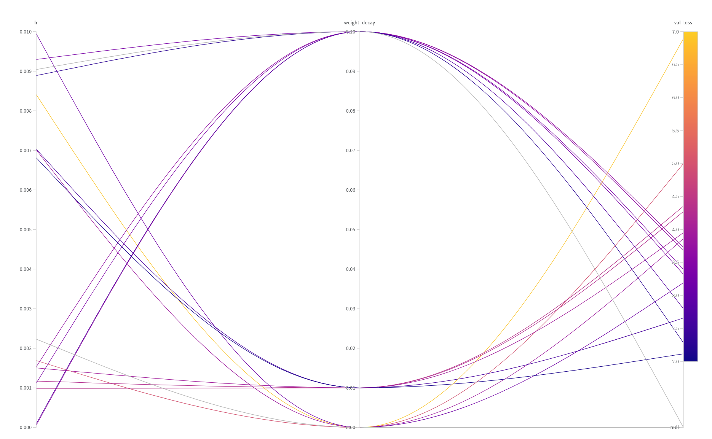

# ml-training-template

A clean, reusable PyTorch training template with experiment tracking, checkpointing, and config-driven hyperparameter sweeps. Built as a reusable foundation for downstream deep-learning projects.

> Demo task: next-day return prediction on stock OHLCV data (AAPL/GE/PSCT). The task is intentionally low-signal — the focus here is the **engineering scaffold**, not the predictive result.

## Features

- **Modular structure** — data, model, and training logic cleanly separated (`dataset.py` / `model.py` / `train.py`).
- **Exact-resume checkpointing** — saves model, optimizer, scheduler, epoch, and RNG state, so a killed run resumes bit-for-bit.
- **Experiment tracking** — Weights & Biases logging of loss / lr / grad-norm and prediction plots.
- **Config-driven** — hyperparameters live in `config.yaml`; command-line flags override for sweeps.
- **Hyperparameter sweeps** — Bayesian search over learning rate and weight decay via W&B Sweeps.
- **Reproducible & clean** — `uv`-managed environment, `ruff` + `pre-commit` enforced on every commit.

## Project structure

```
ml-training-template/
├── dataset.py        # StockWindowDataset + build_train_val_loaders
├── model.py          # model definitions (MLP baseline)
├── utils.py          # save/load checkpoint, helpers
├── train.py          # training loop: train/val, checkpointing, early stopping
├── config.yaml       # hyperparameters
├── sweep.yaml        # W&B sweep configuration
└── assets/           # figures for this README
```

## Setup

```bash
# install uv: https://docs.astral.sh/uv/
uv sync                 # reproduce the environment from pyproject.toml
uv run wandb login      # one-time, for experiment tracking
```

## Usage

```bash
# train with defaults from config.yaml
uv run python train.py

# resume an interrupted run (exact bit-for-bit continuation)
uv run python train.py --resume

# run a hyperparameter sweep
uv run wandb sweep sweep.yaml
uv run wandb agent --count 15 <entity>/<project>/<sweep_id>
```

## Results

### Hyperparameter sweep

Ran a Bayesian sweep over learning rate and weight decay. Learning rate dominated
the outcome, and lower values consistently produced lower validation loss.




## Notes

The demo task (predicting next-day returns) is close to a random walk, so absolute
validation loss is near the naive "always predict zero" baseline — expected for this
target. Direction prediction (up/down) is a more tractable reformulation and a natural
next step. The point of this repo is the training infrastructure, which transfers
directly to higher-signal tasks.

## Stack

PyTorch · Weights & Biases · uv · ruff · pre-commit